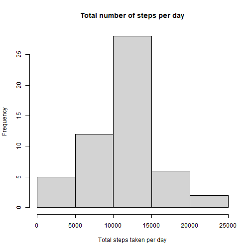
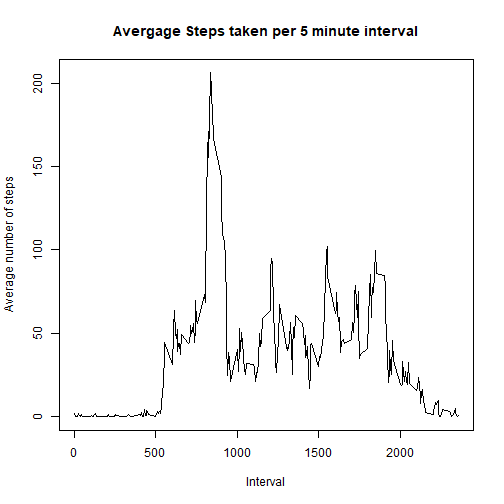
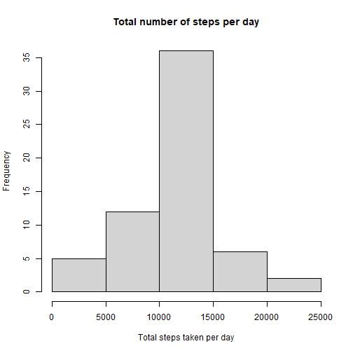

Reproducible Research Course Project 1
======================================
## Loading and preprocessing the data
First, we load the data using read.csv() function and then process the data in a format suitable for analysis

```r
unzip("repdata_data_activity.zip")
activity <- read.csv("activity.csv")
summary(activity)
```

```
##      steps            date              interval     
##  Min.   :  0.00   Length:17568       Min.   :   0.0  
##  1st Qu.:  0.00   Class :character   1st Qu.: 588.8  
##  Median :  0.00   Mode  :character   Median :1177.5  
##  Mean   : 37.38                      Mean   :1177.5  
##  3rd Qu.: 12.00                      3rd Qu.:1766.2  
##  Max.   :806.00                      Max.   :2355.0  
##  NA's   :2304
```
## Q1. What is the mean total steps taken per day?
1. Calculate the total number of steps taken pr day

```r
stepsPerDay <- aggregate(steps ~ date, activity, sum, na.rm = TRUE)
```
2. Make a histogram of the total number of steps per day

```r
hist(stepsPerDay$steps, main = "Total number of steps per day", xlab = "Total steps taken per day")
```



3. Calculate mean of the total steps per day

```r
mean(stepsPerDay$steps)
```

```
## [1] 10766.19
```
4. Calculate median of the total steps per day

```r
median(stepsPerDay$steps)
```

```
## [1] 10765
```
## Q2. What is the average daily activity pattern?
1. Make a time series plot (i.e. type = "l") of the 5-minute interval (x-axis) and the average number of steps taken, averaged across all days (y-axis)

```r
stepsPerInterval <- aggregate(steps ~ interval, activity, mean, na.rm = TRUE)
plot(steps ~ interval, data = stepsPerInterval, type = "l", main = "Avergage Steps taken per 5 minute interval", xlab = "Interval", ylab = "Average number of steps")
```


2. Which 5-minute interval, on average across all the days in the dataset, contains the maximum number of steps?

```r
stepsPerInterval[which.max(stepsPerInterval$steps),]$interval
```

```
## [1] 835
```
## Q3. Imputing missing values
1. Calculate and report the total number of missing values in the dataset (i.e. the total number of rows with NA's)

```r
sum(is.na(activity$steps))
```

```
## [1] 2304
```
2. Devise a strategy for filling in all of the missing values in the dataset. The strategy does not need to be sophisticated. For example, you could use the mean/median for that day, or the mean for that 5-minute interval, etc.

```r
imputed_steps <- stepsPerInterval$steps[match(activity$interval, stepsPerInterval$interval)]
```
3. Create a new database that is equal to the old database but with the missing data filled in

```r
activityNoNA <- transform(activity, steps = ifelse(is.na(activity$steps), yes = imputed_steps, no = activity$steps))
stepsPerDayNoNA <- aggregate(steps ~ date, activityNoNA, sum)
```
4. Make a histogram of the total number of steps taken each day and Calculate and report the mean and median total number of steps taken per day. Do these values differ from the estimates from the first part of the assignment? What is the impact of imputing missing data on the estimates of the total daily number of steps?

```r
hist(stepsPerDayNoNA$steps, main = "Total number of steps per day", xlab = "Total steps taken per day")
```



```r
print(paste0("Mean number of steps take per day: ", mean(stepsPerDayNoNA$steps)))
```

```
## [1] "Mean number of steps take per day: 10766.1886792453"
```

```r
print(paste0("Median number of steps take per day: ", median(stepsPerDayNoNA$steps)))
```

```
## [1] "Median number of steps take per day: 10766.1886792453"
```
As we can see, the mean is unchanged while the median is now the same as the mean
## Q4. Are there differences in activity patterns between weekdays and weekends?
1. Create a new factor variable in the dataset with two levels – “weekday” and “weekend” indicating whether a given date is a weekday or weekend day.

```r
activityNoNA$date <- as.Date(strptime(activityNoNA$date, format="%Y-%m-%d"))
activityNoNA$day <- weekdays(activityNoNA$date)
for (i in 1:nrow(activityNoNA)) {
    if (activityNoNA[i,]$day %in% c("Saturday","Sunday")) {
        activityNoNA[i,]$day<-"weekend"
    }
    else{
        activityNoNA[i,]$day<-"weekday"
    }
}
stepsByDay <- aggregate(activityNoNA$steps ~ activityNoNA$interval + activityNoNA$day, activityNoNA, mean)
```
2. Make a panel plot containing a time series plot (i.e. 𝚝𝚢𝚙𝚎 = “𝚕”) of the 5-minute interval (x-axis) and the average number of steps taken, averaged across all weekday days or weekend days (y-axis).

```r
names(stepsByDay) <- c("interval", "day", "steps")
library(lattice)
xyplot(steps ~ interval | day, stepsByDay, type = "l", layout = c(1, 2), 
    xlab = "Interval", ylab = "Number of steps")
```


